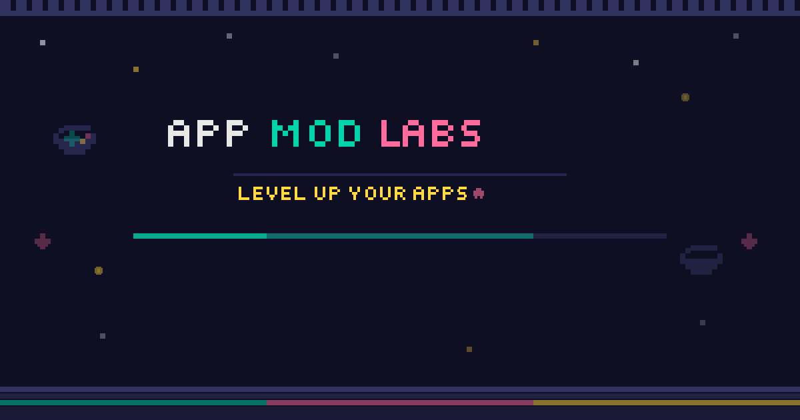

# 🎮 Agentic Application Enablement Labs

> **🚀 [Browse the Live Gallery →](https://EmeaAppGbb.github.io/AppModernizationLabs/)**

[](LICENSE)

**Level Up Your Repos** — A retro 8-bit gallery of hands-on labs for agentic enablement, application modernization, and spec-driven development



## 🤔 What is this?

Agentic Application Enablement Labs is a curated gallery of hands-on, practical labs for enabling your repositories with AI agents and modernizing your applications using Azure and GitHub tools. Labs cover three core areas: **Application Modernization** (modernizing legacy code and infrastructure), **Agentic Software Development** (using SQUAD to build agent-powered systems), and **Spec-Driven Development** (using Spec2Cloud to modernize from specifications).

From .NET monoliths to legacy databases, from cloud infrastructure to AI-powered agentic features—pick a lab, follow the steps, and level up your repo enablement and modernization skills.

## 🚀 Quick Start

Head to the **[Agentic Application Enablement Labs Gallery](https://EmeaAppGbb.github.io/AppModernizationLabs/)** and browse available labs. Click any lab card to:
- See a full description and learning objectives
- Visit the lab's GitHub repository
- Find step-by-step instructions and code samples

## 📦 Adding a Lab

Want to share your modernization lab with the community?

1. **Create an `APPMODLAB.MD` file** in your repository root. Use the [LABTemplate.md](LABTemplate.md) as a starting point—it includes all required metadata fields.

2. **Submit your lab** in one of two ways:
   - Use the **"🎮 Add New Lab"** button on the gallery site
   - Create an [issue using the "Add New Lab" template](.github/ISSUE_TEMPLATE/add-lab.yml)

3. **Get reviewed and added!** The team will review your lab and add it to the gallery. Your lab must:
   - Be in a **public GitHub repository**
   - Include a valid `APPMODLAB.MD` file at the repository root
   - Have a title of **40 characters or less**
   - Have a description of **140 characters or less**

## 📋 APPMODLAB.MD Format

Every lab repository needs an `APPMODLAB.MD` file at the root with metadata in YAML frontmatter:

```yaml
---
title: "Modernize .NET App with Aspire"                    # * Required (40 chars max)
description: "Step-by-step guide..."                      # * Required (140 chars max)
authors: ["octocat", "github-user"]                        # * Required (GitHub handles)
category: "Code Modernization"                             # * Required: Code, Infra, or Data
industry: "Financial Services"                             # * Required (see full list below)
services: ["Azure Container Apps", "Azure CosmosDB"]       # Azure services used
languages: [".NET", "TypeScript"]                          # Tech stack
frameworks: ["Aspire", "Microsoft Agent Framework"]        # Frameworks used
modernizationTools: ["Azure Migrate", "GitHub Copilot"]    # Tools leveraged
tags: ["containers", "aspire", "async"]                    # Custom tags
extensions: []                                              # VS Code extension IDs
thumbnail: "https://example.com/lab-thumb.png"            # (optional) 16:9 aspect ratio
video: "https://example.com/demo.mp4"                     # (optional) Demo video URL
version: "1.0.0"                                           # (optional) Semantic versioning
---

# Your Lab Content Here
```

**Category options:** Code Modernization | Infra Modernization | Data Modernization | Agentic Software Development | Spec-Driven Development

**Industry options:** Cross-Industry | Financial Services | Healthcare & Life Sciences | Manufacturing | Retail & Consumer Goods | Government & Public Sector | Education | Energy & Resources | Telco & Media | Mobility & Automotive

**Language options:** .NET | Python | Java | Go | TypeScript | JavaScript | BICEP | Terraform | COBOL

See [LABTemplate.md](LABTemplate.md) for the complete template with all available fields and descriptions.

## 🏗️ Architecture

The lab gallery ingests labs from repositories and renders them in a browsable, filterable gallery:

```
Your Lab Repo (APPMODLAB.MD)
          ↓
   GitHub Action (Ingestion)
          ↓
   appmodlab.json (Generated)
          ↓
   Gallery Website (Rendered)
```

When you submit a lab, a GitHub Action:
1. Fetches your `APPMODLAB.MD` metadata
2. Validates the format and metadata fields
3. Generates `appmodlab.json` entry with enablement tools and agenticTools
4. Deploys the updated gallery

## 🤝 Contributing

Found a bug? Have an idea? Want to improve the gallery? See [CONTRIBUTING.md](CONTRIBUTING.md) for all the ways you can help.

## 📝 License

This project is licensed under the MIT License—see [LICENSE](LICENSE) file for details. Copyright (c) 2026 Microsoft.

## 💬 Feedback

Have thoughts about the gallery? We'd love to hear them!

- 🐛 **Report a bug** — [Use the issue template](.github/ISSUE_TEMPLATE/report-issue.yml)
- 💬 **Share feedback** — [Tell us what you think](.github/ISSUE_TEMPLATE/feedback.yml)
- 🎮 **Browse the gallery** — [Live site](https://EmeaAppGbb.github.io/AppModernizationLabs/)
